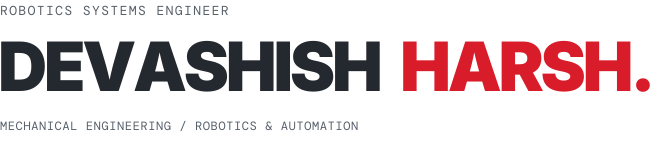
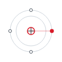
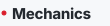
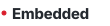
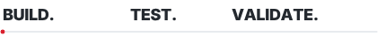
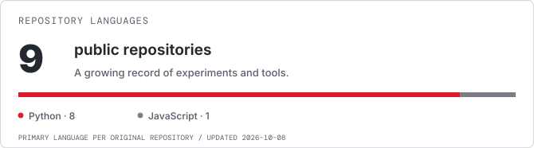

<picture>
  <source media="(max-width: 600px) and (prefers-color-scheme: dark)" srcset="assets/identity-mobile-dark.svg" />
  <source media="(max-width: 600px)" srcset="assets/identity-mobile-light.svg" />
  <source media="(prefers-color-scheme: dark)" srcset="assets/identity-dark.svg" />
  
</picture>

<picture>
  <source media="(prefers-reduced-motion: reduce) and (prefers-color-scheme: dark)" srcset="assets/presence-dark.svg" />
  <source media="(prefers-reduced-motion: reduce)" srcset="assets/presence-light.svg" />
  <source media="(prefers-color-scheme: dark)" srcset="assets/presence-dark.gif" />
  
</picture>

I'm a **robotics systems engineer** with a foundation in mechanical engineering, robotics and automation. I build systems by connecting the mechanics, the sensors and the software—and working through what happens when those pieces meet.

I'm drawn to machines that can **perceive, learn and move**. My personal work is a growing collection of solo research, simulation experiments and tools built to understand those capabilities better.

 

<picture>
  <source media="(prefers-color-scheme: dark)" srcset="assets/ambition-dark.svg" />
  
</picture>

I want to bring perception, intelligence and physical design together so robotic systems can act usefully in the world. I'm interested in the entire process: understanding a problem, building the system, testing its behavior and finding out what needs to change.

<picture>
  <source media="(prefers-color-scheme: dark)" srcset="assets/skills-dark.svg" />
  
</picture>

<table>
  <tr>
    <td width="50%" valign="top">
      <picture><source media="(prefers-color-scheme: dark)" srcset="assets/skill-1-dark.svg" /></picture> 
      PX4 · ROS 2 · reinforcement learning 
      Navigation, coordination and control.
    </td>
    <td width="50%" valign="top">
      <picture><source media="(prefers-color-scheme: dark)" srcset="assets/skill-2-dark.svg" /></picture> 
      OpenCV · MediaPipe · LiDAR 
      Vision, hand tracking and sensor integration.
    </td>
  </tr>
  <tr>
    <td width="50%" valign="top">
      <picture><source media="(prefers-color-scheme: dark)" srcset="assets/skill-3-dark.svg" /></picture> 
      URDF · Gazebo · PyBullet · RViz 
      Robot descriptions and simulation workflows.
    </td>
    <td width="50%" valign="top">
      <picture><source media="(prefers-color-scheme: dark)" srcset="assets/skill-4-dark.svg" /></picture> 
      Fusion 360 · Solid Edge · Ansys FEA 
      CAD, structural analysis and physical design.
    </td>
  </tr>
  <tr>
    <td width="50%" valign="top">
      <picture><source media="(prefers-color-scheme: dark)" srcset="assets/skill-5-dark.svg" /></picture> 
      Python · ROS 2 bridges · local AI tools 
      Connecting models, messages and useful actions.
    </td>
    <td width="50%" valign="top">
      <picture><source media="(prefers-color-scheme: dark)" srcset="assets/skill-6-dark.svg" /></picture> 
      ESP32 · Arduino · Raspberry Pi · PID 
      Devices, communication and feedback.
    </td>
  </tr>
</table>

<picture>
  <source media="(prefers-color-scheme: dark)" srcset="assets/practice-dark.svg" />
  
</picture>

I model the mechanics, connect the sensing and control, run the simulation and inspect the behavior. When something fails, I trace the cause and revise the system. Getting an idea to work is the beginning; understanding **why it works and where it fails** is what makes the next iteration better.

<picture>
  <source media="(prefers-reduced-motion: reduce) and (prefers-color-scheme: dark)" srcset="assets/practice-motion-dark.svg" />
  <source media="(prefers-reduced-motion: reduce)" srcset="assets/practice-motion-light.svg" />
  <source media="(prefers-color-scheme: dark)" srcset="assets/practice-dark.gif" />
  
</picture>

<picture>
  <source media="(prefers-color-scheme: dark)" srcset="assets/code-dark.svg" />
  
</picture>

My repositories are the working record: the experiments, tools and iterations behind what I'm learning.

<picture>
  <source media="(max-width: 600px) and (prefers-color-scheme: dark)" srcset="assets/public-code-mobile-dark.svg" />
  <source media="(max-width: 600px)" srcset="assets/public-code-mobile-light.svg" />
  <source media="(prefers-color-scheme: dark)" srcset="assets/public-code-dark.svg" />
  
</picture>

I'm here to exchange ideas with people who build and test robots. You can also find me on [LinkedIn](https://www.linkedin.com/in/devashishharsh/).
