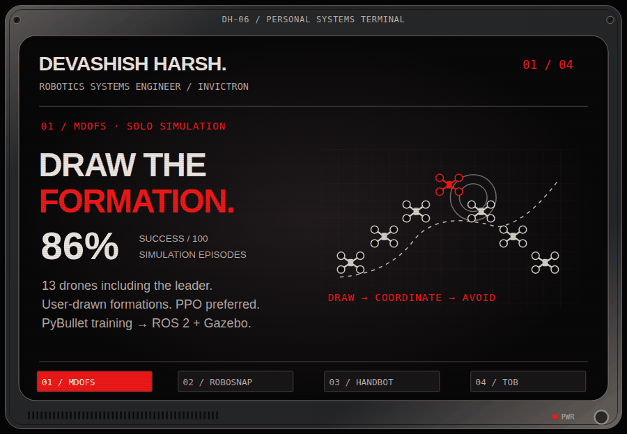

<picture>
  <source media="(max-width: 600px)" srcset="assets/lab-console-mobile.svg" />
  <source media="(prefers-reduced-motion: reduce)" srcset="assets/lab-display.svg" />
  
</picture>

PROJECT DISPLAY / OPEN A FILE BELOW

#### SELECT A FILE

| Formation & autonomy | Robot assembly | Human interaction |
| :--- | :--- | :--- |
| **[01 / MDOFS ↗](https://github.com/DevashishHarsh/Multi-Drone-PX4-RL)** | **[02 / RoboSnap ↗](https://github.com/DevashishHarsh/RoboSnap)** | **[03 / HandBot ↗](https://github.com/DevashishHarsh/OpenCV-HandBot)** |

**[04 / TOB research notes ↓](#research-notes)** &nbsp; · &nbsp; **[All repositories ↗](https://github.com/DevashishHarsh?tab=repositories)** &nbsp; · &nbsp; **[LinkedIn ↗](https://www.linkedin.com/in/devashishharsh/)**

<strong>WORKSHOP DRAWER / More tools and experiments</strong>

| File | What I use it to explore |
| :--- | :--- |
| [Drone-Deconflictor](https://github.com/DevashishHarsh/Drone-Deconflictor) | Generated UAV trajectories, sampled distance checks and Gaussian uncertainty modeling. Simulation data; no real flights. |
| [DroneRL](https://github.com/DevashishHarsh/DroneRL) | SAC navigation policies trained and inspected in PyBullet. |
| [PX4 + ROS 2 workspace](https://github.com/DevashishHarsh/px4_ros2_ws) | Setup and examples for PX4 drones in ROS 2 simulation. |
| [xacro2urdf](https://github.com/DevashishHarsh/xacro2urdf) | Fusion 360 exporter Xacro output converted into usable URDF descriptions. |
| [Elements-OpenCV](https://github.com/DevashishHarsh/Elements-OpenCV) | Hand gestures, animated overlays and procedural effects on webcam video. |

### Research notes

<strong>01 / MDOFS — Multi-Drone Object Avoidance Formation System</strong>

A solo ROS 2 / PX4 simulation for user-drawn formations. My machine supported **13 drones including the leader**. The leader used LiDAR for navigation and obstacle avoidance; formation configurations could be stored onboard.

I explored SAC, then PPO, which performed best in my trials. Training happened in **PyBullet**, while the multi-drone system was validated in **ROS 2 and Gazebo**. My evaluation reported **86% success across 100 simulation episodes**.

[Open Multi-Drone-PX4-RL ↗](https://github.com/DevashishHarsh/Multi-Drone-PX4-RL)

<strong>02 / RoboSnap — Build a robot from parts</strong>

A browser editor for assembling robot descriptions like LEGO: fixed attachments connect parts, and reusable joint parts provide movement. I used it to assemble arms, wheeled robots, a wheeled HandBot and spider-leg arrangements. Inspect the assembly in 3D and export a URDF package.

Getting the parts to snap precisely, and accommodating different robot models, took substantial iteration. The Fusion 360 exporter workflow also led to my **xacro2urdf** tool.

[Open RoboSnap ↗](https://github.com/DevashishHarsh/RoboSnap)

<strong>03 / HandBot — A hand in virtual space</strong>

MediaPipe tracks hand landmarks and maps orientation and finger motion to a simulated robotic hand in PyBullet. I built it to study how my hand appears in virtual space and how it can interact with virtual objects using a camera.

Replicating the hand's mechanics and joint behavior was a major challenge. Camera depth remains a limitation. Gesture recognition is integrated and reached **88% accuracy in a later personal run**; the older public notebook reports about **83%**.

[Open OpenCV-HandBot ↗](https://github.com/DevashishHarsh/OpenCV-HandBot)

<strong>04 / TOB — The Ordinary Being / in development</strong>

A personal working partner with a personality, built around my work. The local model runs on my computer and connects to tools for conversation, launching ROS 2 nodes, inspecting topics, starting programs and monitoring running processes.

The current **ESP32 watch connects over Wi-Fi** as a gateway to that system. **Web and Android interfaces and ROS-Edge are planned.** The illustrated phone shows that future interface.

<strong>ENGINEERING RECORD / Systems, simulation and physical design</strong>

I am a **robotics systems engineer at Invictron**, working from system design through building, testing and validation. My public projects are solo research and tools for the robotics community. My B.Tech in Mechanical Engineering specialized in Robotics and Automation.

**Private work at Invictron:** I contribute to building and testing GPS-denied navigation and one-way UAV systems. Internal designs, results and company assets stay private.

**Mechanical work:** at Polycraft Tech, I worked on compact locking hardware, prosthetic adapters, precision parts, FEA, manufacturing drawings and prototype guidance. I used Fusion 360 and Ansys to guide geometry. For the TugBot capstone, I contributed to electronics, analysis and design; only the baseplate was built.

**Working stack:** PX4, ROS 2, LiDAR, SAC/PPO, OpenCV, MediaPipe, Gazebo, PyBullet, URDF, RViz, Python, Fusion 360, Solid Edge, Ansys FEA, Arduino, Raspberry Pi, ESP32 and PID control.

BUILD. TEST. VALIDATE. KEEP BUILDING.
