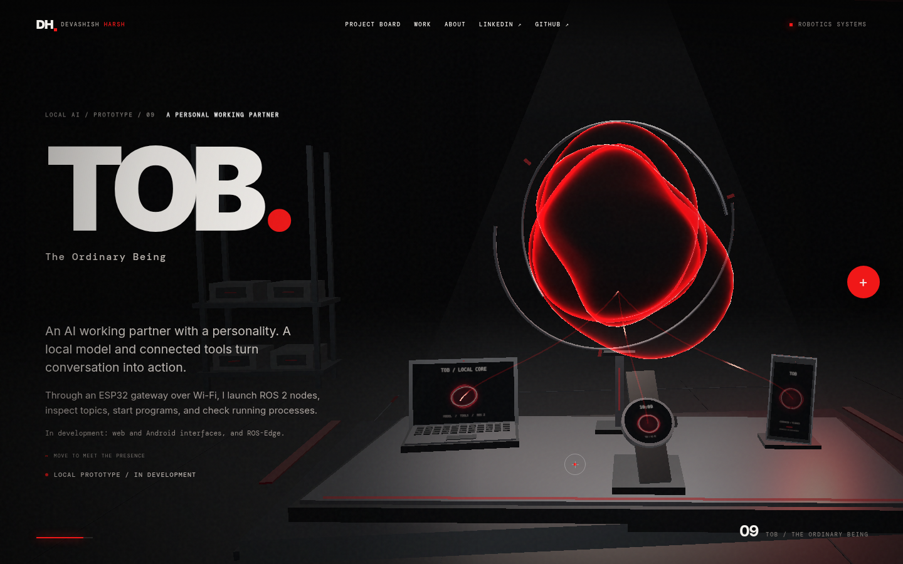

  

  <strong>BUILD MACHINES THAT UNDERSTAND MOTION.</strong> 
  PERCEPTION / AUTONOMY / SIMULATION / DESIGN

  <a href="#01--the-system">THE SYSTEM</a> &nbsp;·&nbsp;
  <a href="#02--selected-builds">SELECTED BUILDS</a> &nbsp;·&nbsp;
  <a href="#03--specialities">SPECIALITIES</a> &nbsp;·&nbsp;
  <a href="#04--beyond-code">BEYOND CODE</a> &nbsp;·&nbsp;
  <a href="#06--tob--the-ordinary-being">TOB</a> &nbsp;·&nbsp;
  <a href="https://www.linkedin.com/in/devashishharsh/">LINKEDIN ↗</a>

---

### 01 / THE SYSTEM

I am a robotics systems engineer at Invictron. My public repositories are solo experiments and tools for the robotics community, working across the full loop: from sensing and state estimation to autonomous decisions, control, simulation, and physical design. My B.Tech in Mechanical Engineering specialized in Robotics and Automation; the work below is where those disciplines meet.

**The through-line:** a robot is only as good as the connection between its sensors, its software, and the machine that must carry out the decision. I like building and testing those connections, then making the next iteration better.

### 02 / SELECTED BUILDS

**Multi-Drone PX4 + RL** — A solo ROS 2 / PX4 simulation for drawn formations, demonstrated with 13 drones including a LiDAR-equipped leader. Navigation policies were trained in PyBullet and validated in Gazebo. I explored SAC, then PPO, which performed best in my trials. My evaluation reported 86% success across 100 simulation episodes. **[OPEN REPOSITORY ↗](https://github.com/DevashishHarsh/Multi-Drone-PX4-RL)**

**RoboSnap** — A browser editor for assembling robot descriptions like LEGO, using fixed attachments and reusable joint parts. Build arms and rovers, inspect them in 3D, and export URDF packages. **[OPEN REPOSITORY ↗](https://github.com/DevashishHarsh/RoboSnap)**

**OpenCV HandBot** — A computer vision interaction project. MediaPipe tracks a person's hand and maps its landmarks, orientation, and finger states to a simulated robotic hand in PyBullet. Camera depth remains a limitation. Gesture recognition reached 88% accuracy in a later personal run; the older public notebook reports about 83%. **[OPEN REPOSITORY ↗](https://github.com/DevashishHarsh/OpenCV-HandBot)**

**MORE FROM THE WORKSHOP**

- **[Drone-Deconflictor](https://github.com/DevashishHarsh/Drone-Deconflictor)** — Inspect generated UAV trajectories using sampled distance checks and Gaussian uncertainty modeling, with a 3D timeline. No real-flight validation.
- **[DroneRL](https://github.com/DevashishHarsh/DroneRL)** — Train and inspect a drone navigation agent in a PyBullet environment with Soft Actor-Critic.
- **[PX4 + ROS 2 workspace](https://github.com/DevashishHarsh/px4_ros2_ws)** — Setup and examples for PX4 drones in ROS 2 simulation.
- **[xacro2urdf](https://github.com/DevashishHarsh/xacro2urdf)** — Convert the Fusion 360 exporter’s Xacro output into a URDF robot description.
- **[Elements-OpenCV](https://github.com/DevashishHarsh/Elements-OpenCV)** — A MediaPipe / OpenCV experiment using hand gestures, animated overlays, and procedural effects on webcam video.

### 03 / SPECIALITIES

**AUTONOMY / FLIGHT** &nbsp; PX4, ROS 2, LiDAR obstacle avoidance, formation control, path planning, SAC and PPO.

**PERCEPTION / INTERACTION** &nbsp; OpenCV, MediaPipe, hand tracking, gesture recognition, sensor integration and telemetry.

**ROBOT MODELS / SIMULATION** &nbsp; URDF, Gazebo, PyBullet, RViz, Python and repeatable simulation workflows.

**MECHANICAL DESIGN / VALIDATION** &nbsp; Fusion 360, Solid Edge, CAD, FEA, structural analysis, manufacturing drawings and prototyping.

**SOFTWARE / EMBEDDED** &nbsp; Python tooling, ROS 2 bridges, Arduino, Raspberry Pi and PID control.

**AI EXPLORATION** &nbsp; Reinforcement learning and TOB: connecting a local AI model to computer tools.

### 04 / BEYOND CODE

My mechanical engineering work is part of the same robotics practice. At Polycraft Tech, I worked on compact locking hardware, prosthetic adapters, precision parts, FEA, drawings, and prototype guidance. I used Fusion 360 and Ansys FEA to guide geometry, then prepared designs for manufacturing and prototype evaluation.

### 05 / PRIVATE WORK

**GPS-DENIED AUTONOMY** &nbsp; `PRIVATE`  
At Invictron, I contribute to building and testing UAV systems for navigation in GPS-denied environments.

**KAMIKAZE DRONES** &nbsp; `PRIVATE`  
At Invictron, I contribute to building and testing one-way UAV systems. No public repository.

### 06 / TOB — THE ORDINARY BEING

PORTFOLIO VISUALIZATION / LOCAL AI PROTOTYPE / PHONE INTERFACE PLANNED

A local AI agent ecosystem and personal working partner designed around my work. The current prototype connects an ESP32 watch over Wi-Fi to a local model on my computer. It supports conversation, launching ROS 2 nodes, inspecting topics, starting programs, and monitoring running processes.

The watch is a gateway to the system. Web and Android interfaces, and ROS-Edge, are planned.

### 07 / KEEP BUILDING

The repositories here are parts of a wider engineering practice. I prototype, simulate, inspect the result, and iterate. This profile carries the same systems-focused story as my visual portfolio.

  <a href="https://github.com/DevashishHarsh?tab=repositories">ALL PUBLIC REPOSITORIES ↗</a>
  &nbsp;&nbsp;·&nbsp;&nbsp;
  <a href="https://www.linkedin.com/in/devashishharsh/">CONNECT ON LINKEDIN ↗</a>

